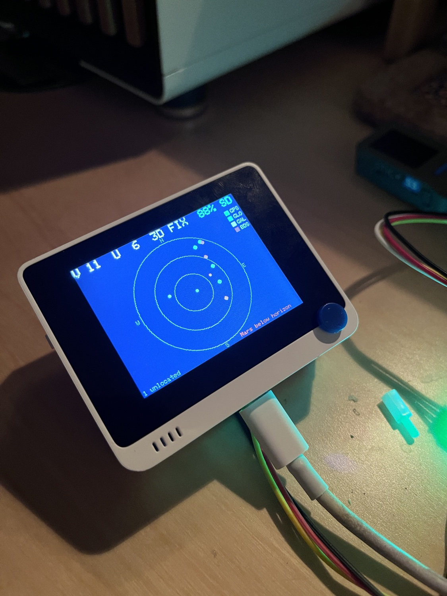

# Orbital Density (Wio Terminal)

A Wio Terminal that visualizes what's *above* it. **Milestone 1 — GPS sky view:**
a live polar "radar" of every satellite the Air530 GNSS module can hear
(GPS + GLONASS + Galileo + BeiDou), colored by constellation, plus a numeric
detail page, a 24-hour satellite-count chart, reception-anomaly alerts, the
live position of **Mars** on the sky, and microSD logging with a real UTC clock
from the satellites. **Plus a first extra sensor:** a Grove Dust Sensor feeding
a relative "dust activity" page.



Planned later milestones add an **ambient-light sensor** and a
**magnetometer/compass** — the firmware and CSV are structured so those slot in
as extra sensors, pages, and columns.

**Maintainer:** George Babanau · actively maintained (Aug 2026)

## Hardware

- Seeed Wio Terminal (SAMD51).
- Air530 GNSS module (multi-constellation, NMEA 0183 over UART @ 9600).
- Grove Dust Sensor (Shinyei PPD42NS), digital pulse output.

### Wiring — use the 40-pin HEADER UART, not a Grove port

The Air530 must connect to the Wio's hardware UART on the **40-pin header**:

| GPS wire | Wio header pin |
|----------|----------------|
| TX       | **pin 10** (BCM15 / RXD / `Serial1` RX) |
| RX       | pin 8 (BCM14 / TXD) — optional, GPS only transmits |
| VCC      | pin 1 (3V3) |
| GND      | pin 6 (GND) |

⚠️ **The D0/D1 (A0/A1) Grove port does _not_ work for this.** Those pins are
PB08/PB09 (SERCOM4/PAD0-1, function D); the signal arrives but the SERCOM
would not latch it in testing. Only the header UART (`Serial1`, on PB26/PB27 =
BCM14/BCM15) reliably reads the module. Use a Grove-to-female-jumper cable from
the module to the header pins above.

### Dust sensor wiring — the D0/D1 Grove port (plain GPIO works fine here)

The dust sensor's signal (yellow) plugs into the Wio's **D0/D1 (A0/A1) Grove
port**, signal on **D0**. Unlike the GPS, this works fine there: the sensor
only needs a plain digital input (pulse-width timing), not a UART, and that's
a normal GPIO function on those pins.

⚠️ **Grove VCC is 3.3V; this sensor is rated 5V.** Readings are therefore a
relative "dust activity" indicator, not a calibrated concentration — confirmed
working via a real dust stimulus (vacuuming near the sensor produced a clear,
repeatable response). **Do not power it from the Wio's 5V pin without also
adding a resistor divider on the signal line** — no SAMD51 GPIO pin is
5V-tolerant (confirmed against the datasheet), so a 5V-driven output would risk
damaging whichever pin it's wired to.

⚠️ **Don't use `pulseIn()` for this sensor on this core.** It does not return
`0` on a clean timeout — confirmed at bring-up: it returned a bogus
near-`ULONG_MAX` value on essentially every timeout, at a rate matching its own
1-second internal timeout exactly. `firmware/m2_skyview` instead polls the pin
with `digitalRead()` + `micros()` every loop iteration, which sidesteps the bug
entirely.

## Firmware

| Sketch | Purpose |
|--------|---------|
| `firmware/m1_gps`     | serial-only bring-up: NMEA read + TinyGPS++ summary |
| `firmware/m1_dust`    | serial-only bring-up: dust sensor pulse polling |
| `firmware/m2_skyview` | full UI: sky/detail/chart/dust pages, SD logging ← **current** |

Build and flash (close any serial monitor first — it locks the port):

```sh
arduino-cli compile --fqbn Seeeduino:samd:seeed_wio_terminal firmware/m2_skyview
arduino-cli upload  --fqbn Seeeduino:samd:seeed_wio_terminal -p /dev/cu.usbmodemXXX firmware/m2_skyview
```

Requires the Seeed SAMD board package and libraries **TinyGPSPlus**,
**Seeed Arduino FS** (SD), **SparkFun BQ27441** (battery), and TFT_eSPI (bundled
with the Seeed core). The GPS module needs a clear-ish sky / windowsill; cold
start takes 1–2 minutes to a fix.

## Display & controls

Four pages, cycled with the **top-left button (KEY_C)**: Sky → Detail → Chart →
Dust → back to Sky. The **5-way switch center-press toggles the screen** on/off
(GPS parsing, dust polling, and SD logging keep running while it's off — the
backlight is the main power draw).

Header (all pages): `V <in-view>  U <used>  <fix>`, battery % (if the chassis
fuel gauge is present), and a green `SD` / red `SD!` badge.

- **Sky page** — polar plot: center = zenith, rim = horizon (ring at 30°/60°
  elevation), compass N/E/S/W. Each satellite is a dot **colored by
  constellation** (GPS green, GLONASS cyan, Galileo orange, BeiDou magenta),
  sized by signal strength. Satellites that are heard but not yet positioned
  (before a fix, or without ephemeris) show as an "N unlocated" count.
  **Mars** is plotted as a red circled dot labelled "Mars" at its true
  altitude/azimuth when above the horizon (a low-precision ephemeris computed
  from the GPS position + UTC; "Mars below horizon" otherwise). Note the plot
  assumes the device is pointed north — there's no on-board compass.
- **Detail page** — numeric: in view (and positioned), per-constellation
  counts, satellites used, fix type, HDOP, strongest SNR, lat/lon, altitude,
  UTC time.
- **Chart page** — satellites over the last **24 h**: green = in view, orange =
  unlocated, with UTC **hour markers** (00–23) along the bottom and value
  gridlines (0 / mid / max) on the left. Shows the current value (`now N`) and
  a white **peak marker** labelled with the peak value and the UTC time it
  occurred (`peak N @HH:MM`). Samples once every 5 minutes.
- **Dust page** — `Ratio: X.XX%   N pcs` (LPO ratio and a Shinyei-curve
  concentration estimate, both labelled "relative activity - uncalibrated"),
  plus a 2-hour rolling chart sampled once every 30 seconds (the sensor's own
  spec window). Yellow line, `0`/max gridlines, `-2h`/`now` markers.

### Reception anomaly detection

Once a fix has been established, a red banner flags reception-health problems:
`FIX LOST`, `HI HDOP` (poor geometry), `LOW SAT` (few satellites used), or
`LOW SNR` (all signals weak) — the signatures of obstruction, interference, or
jamming. It's heuristic reception monitoring, not certified anti-spoofing. The
active state is also written to the `anom` column of every log row.

**In view vs used vs unlocated:** *in view* = satellites the receiver hears
(GSV). *used* = the subset locked into the position fix (GGA). *unlocated* =
in-view satellites whose sky position isn't known yet.

## Data

Logs one row per minute to `/gps.csv` on the microSD:

```
utc,uptime_s,in_view,positioned,used,fix,hdop,gps,glonass,galileo,beidou,anom,dust_ratio,dust_conc
```

`anom` is the reception-anomaly state at that minute (`OK` or a code like
`LOW SAT`). `dust_ratio`/`dust_conc` are the dust sensor's latest 30-second-window
values (see the Dust page above) — relative/uncalibrated, not µg/m³.

`utc` is a real ISO timestamp from the GPS clock (blank until the first fix —
the satellites are the clock, so no RTC/battery is needed); `uptime_s` is
always present as a fallback.

## To do

Future sensors (the broader "orbital density" vision), each an added
sensor + page/columns:

- **Magnetometer / compass** — external, on the I2C Grove port (the Wio has no
  built-in one; its IMU is an accelerometer only). Auto-orient the sky plot to
  true North instead of assuming the device is pointed north.
- **Ambient-light sensor.**
- Dust sensor: if better accuracy is ever wanted, power from 5V with a
  resistor divider on the signal line (see the wiring warning above) — not
  pursued for now since 3.3V already gives a usable relative signal.

## Repo layout

```
firmware/   Arduino sketches (m1 GPS bring-up, m2 sky view)
PLAN.md     design & implementation plan
```
