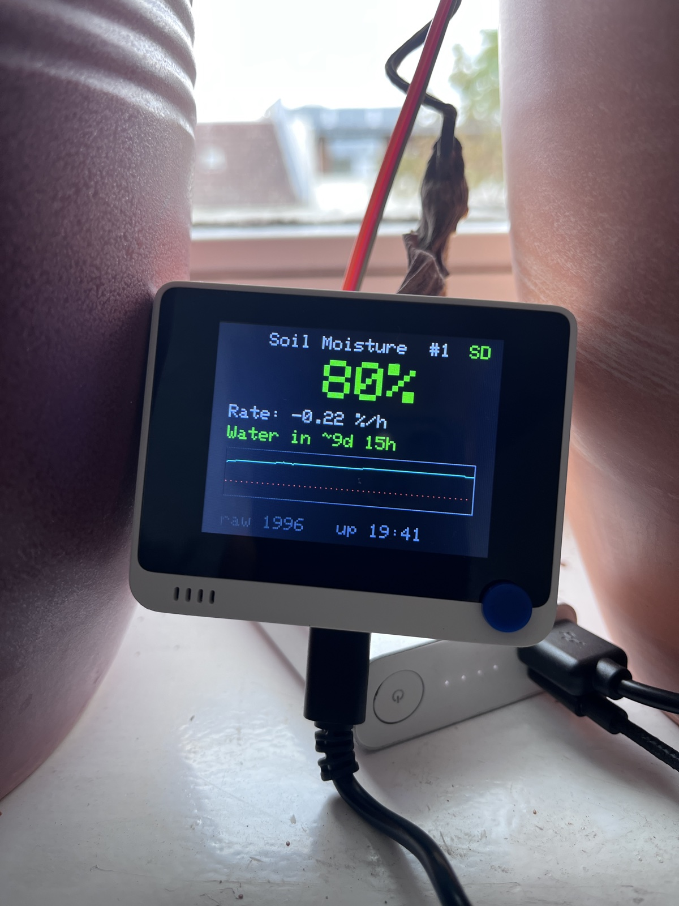

# Soil Moisture Monitor

A plant monitor built on the Seeed Wio Terminal and capacitive soil moisture
sensors (v1.2). Shows live moisture %, drying rate and a "water in ~X days"
estimate on the LCD, chirps when the plant needs water, and logs one sample
per minute to microSD so history survives reboots.




**Maintainer:** George Babanau · actively maintained (Aug 2026)

## Hardware

- Seeed Wio Terminal (SAMD51 — 3.3 V logic, GPIO **not** 5 V tolerant)
- Capacitive Soil Moisture Sensor v1.2, powered from 3.3 V
- microSD card formatted **FAT32** (factory exFAT on 64 GB+ cards will not mount)

Wiring on the rear 40-pin header:

| Sensor | Header pin | Function |
|--------|-----------|----------|
| VCC    | 1         | 3.3 V    |
| GND    | 6         | GND      |
| AOUT   | 13        | A0       |

⚠️ Verify pin 1 before wiring: Seeed's pinout graphic has ambiguous mirror
orientation. Trust the sticker on the device's back, or measure ≈3.3 V
between pins 1 and 6.

## Firmware

Milestones build on each other; `m4_sdlog` is what runs on the device.

| Sketch | Adds |
|--------|------|
| `firmware/m1_bringup`  | raw ADC over serial (wiring/sensor validation) |
| `firmware/m2_moisture` | calibrated % on the LCD |
| `firmware/m3_trends`   | 48 h history, watering detection, drying rate, ETA, buzzer |
| `firmware/m4_sdlog`    | SD logging + restore-on-boot |
| `firmware/m5_power`    | screen toggle + on-device trend reset ← **current** |

Controls (m5): **center-press the 5-way switch** to toggle the screen
(logging continues with it off — the backlight is the main power draw);
**hold the top-left button (KEY_C) for 3 s** after moving the probe — it
chirps, clears the trend history, and writes a `#RESET` marker to the log.

Build and flash (close any open serial monitor first — it locks the port
and uploads fail):

```sh
arduino-cli compile --fqbn Seeeduino:samd:seeed_wio_terminal --export-binaries firmware/m4_sdlog
arduino-cli upload  --fqbn Seeeduino:samd:seeed_wio_terminal -p /dev/cu.usbmodemXXX firmware/m4_sdlog
```

Requires the Seeed SAMD board package and the "Seeed Arduino FS" library.
Per-sensor calibration anchors live at the top of each sketch — see
[CALIBRATION.md](CALIBRATION.md).

## Display

What each element on the dashboard means and the values it can show:

| Element | Meaning | Possible values |
|---------|---------|-----------------|
| `Soil Moisture #1` | header; `#1` = sensor ID | fixed (`#1` until multi-sensor support) |
| `SD` / `SD!` (top right) | SD card status | green `SD` = logging OK; red `SD!` = no card or write failed (remount retried every minute) |
| `76%` (large) | calibrated moisture, live reading (1 s refresh) | `0%`–`100%`, clamped; red < 30%, yellow 30–49%, green ≥ 50% |
| `Rate:` | drying rate — least-squares slope over the last ≤ 6 h of 1-min means | `collecting N/30m` (`N` = 0–29) for the first 30 min after boot/watering/reset, then signed `±D.DD %/h` (typically −3…+3; positive = getting wetter) |
| `ETA:` | time until the 30% watering threshold, linear extrapolation | `--` (still collecting) · `not drying` (rate ≥ −0.005 %/h) · `Water in ~Dd HHh` (days 0–99, hours 00–23) · `>99 days` · red `WATER NOW!` + chirp at ≤ 30% |
| chart | last 48 h of 1-min moisture means (cyan), restored from SD on boot | y-axis fixed 0–100%; red dotted line = 30% threshold |
| `raw` | latest 12-bit ADC median (lower = wetter) | 0–4095 theoretical; ~1570 (water) to ~3690 (dry air) at 3.3 V — pinned near 0/4095 means a wiring fault |
| `up H:MM` | time since power-on | hours unbounded, resets each boot (unlike the CSV `minute` counter, which persists) |

The rate/ETA/chart refresh once per logging minute; the trend fit restarts
(→ `collecting N/30m`) after a reboot, a watering event (> +5 points in
5 min), or a KEY_C trend reset.

## Data

The device appends to `/soil.csv` on the SD card:

```
boot,minute,sensor,raw,pct
```

One row per minute, plus `#RESET,<minute>` marker rows written when the
trend history is reset after moving the probe (restore-on-boot ignores data
before the last marker). `minute` keeps counting across reboots, but time
spent powered off is not counted (no battery-backed clock). On boot the last 48 h
are restored to the on-screen sparkline; the drying-rate fit restarts.

To import the data into [Atlas Workspace](https://www.atlasworkspace.ai/)
(which accepts Markdown notes, not CSV), generate a Markdown report:

```sh
python3 tools/export_report.py soil.csv -o report.md --start 2026-08-16T21:00
```

`--start` anchors minute 0 to a real timestamp.

## To do

- Factor ambient temperature and humidity into the watering ETA formula —
  drying speeds up in warm/dry air, so the current moisture-only slope over-
  or underestimates. Needs an external temp/RH sensor (e.g. SHT31 or DHT22 on
  the left Grove I2C port; the Wio Terminal has none onboard).
- Home Assistant integration — publish moisture/rate/ETA over WiFi (onboard
  RTL8720) via MQTT so HA discovers the plant as a sensor entity; alerts and
  history then live in HA alongside the on-device display.

## Repo layout

```
firmware/    Arduino sketches (one per milestone)
tools/       host-side utilities (CSV → Markdown report)
PLAN.md      original build plan and roadmap
CALIBRATION.md  per-sensor calibration log
```
